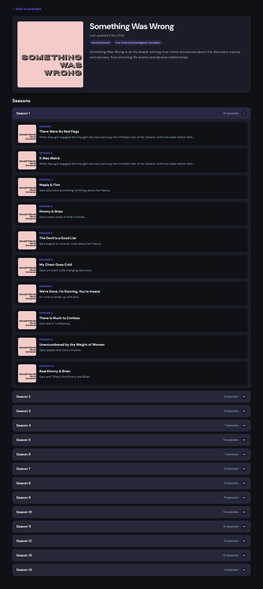

# DJS05 Show Detail Page with Routing and Navigation

This is a solution to the **DJS05 Show Detail Page with Routing and Navigation** coursework project — a podcast browsing app with search, sort, filter, pagination, dynamic show detail pages, and season navigation. The app fetches data from the [Podcast API](https://podcast-api.netlify.app) and lets users explore shows, open individual podcasts at unique URLs, and return to the homepage without losing their browse state.

## Table of contents

- [Overview](#overview)
  - [The challenge](#the-challenge)
  - [Screenshot](#screenshot)
- [My process](#my-process)
  - [Built with](#built-with)
  - [What I learned](#what-i-learned)
  - [Continued development](#continued-development)
  - [Useful resources](#useful-resources)
- [Author](#author)
- [Acknowledgments](#acknowledgments)

## Overview

### The challenge

Users should be able to:

- View a list of podcasts fetched from the remote API
- Search podcasts by title with results updating as they type
- Sort podcasts by newest first, title A–Z, or title Z–A
- Filter podcasts by one or more genres using a multi-select control
- Paginate through results without losing active search, sort, or filter state
- Click a podcast to open a dedicated detail page at a unique URL (`/show/:id`)
- See full show details including title, image, description, genre tags, and a formatted last-updated date
- Browse seasons and episodes with expand/collapse navigation
- Return to the homepage with previous search, filter, sort, and page state preserved
- See loading, error, and empty states when data is fetching or unavailable
- See a responsive layout that works across different screen sizes
- See hover and focus states on all interactive elements

### Screenshot



## My process

### Built with

- Semantic HTML5 markup
- CSS custom properties
- CSS Grid & Flexbox
- Mobile-first responsive workflow
- [React](https://reactjs.org/) — UI library
- [Vite](https://vitejs.dev/) — build tool and dev server
- [React Router](https://reactrouter.com/) — client-side routing and URL state
- React Context — centralised browse state management
- Custom hooks — `useShow` for detail-page data fetching
- Plain CSS — no UI framework

### What I learned

This project built on the browsing patterns from DJS04 and added **routing**, **async detail fetching**, and **cross-page state preservation**.

Dynamic routes made each show bookmarkable and shareable. React Router's `useParams` hook reads the show ID from the URL, and a custom `useShow` hook handles loading, success, and error states:

```jsx
export function useShow(showId) {
  const [show, setShow] = useState(null);
  const [loading, setLoading] = useState(true);
  const [error, setError] = useState(null);

  useEffect(() => {
    // fetch show by ID, handle cancellation on unmount
  }, [showId]);

  return { show, loading, error };
}
```

To preserve browse state when navigating back from a detail page, search, genre filters, sort order, and the current page are synced to URL query parameters on the homepage:

```js
export function buildBrowseSearchParams({ searchQuery, selectedGenres, sortBy, currentPage }) {
  const params = new URLSearchParams();
  if (searchQuery.trim()) params.set("q", searchQuery.trim());
  if (selectedGenres.length > 0) params.set("genres", selectedGenres.join(","));
  if (sortBy !== "newest") params.set("sort", sortBy);
  if (currentPage > 1) params.set("page", String(currentPage));
  return params;
}
```

For shows with many seasons, an accordion-style `SeasonNavigation` component keeps the page manageable — only one season expands at a time, showing episode number, title, season image, and a shortened description.

I also learned that URL syncing should only run on the homepage. Writing query parameters while on a detail route would wipe the saved browse state from the address bar.

### Continued development

- Write unit tests for `podcastUtils.js`, `truncateText.js`, and the `useShow` hook
- Add loading skeletons instead of plain text while podcasts and show details fetch
- Add an audio player for episode playback
- Allow multiple seasons to remain expanded at the same time
- Consider debouncing the search input for larger datasets
- Map detail-page genre strings to the same local genre ID lookup used on the homepage

### Useful resources

- [Podcast API](https://podcast-api.netlify.app) — source of all podcast preview and show detail data used in this project
- [React Router documentation](https://reactrouter.com/en/main) — dynamic routes, `useParams`, and `useSearchParams`
- [React Context documentation](https://react.dev/reference/react/useContext) — helped with structuring centralised app state
- [Vite documentation](https://vitejs.dev/guide/) — setup, dev server, and production build
- [The Markdown Guide](https://www.markdownguide.org/) — formatting this README

## Author

- GitHub - [@Nthabi2905](https://github.com/Nthabi2905)

## Acknowledgments

- Course materials and brief for the DJS05 Show Detail Page with Routing and Navigation project
- [Podcast API](https://podcast-api.netlify.app) for providing preview and show detail data
- Genre metadata supplied in the project `data.js` file
- DJS04 project patterns for search, sort, filter, and pagination
